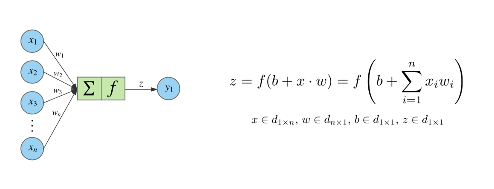
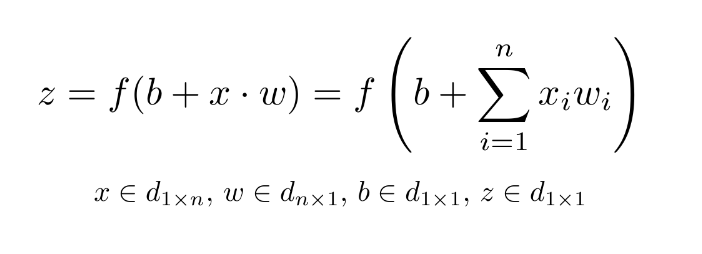
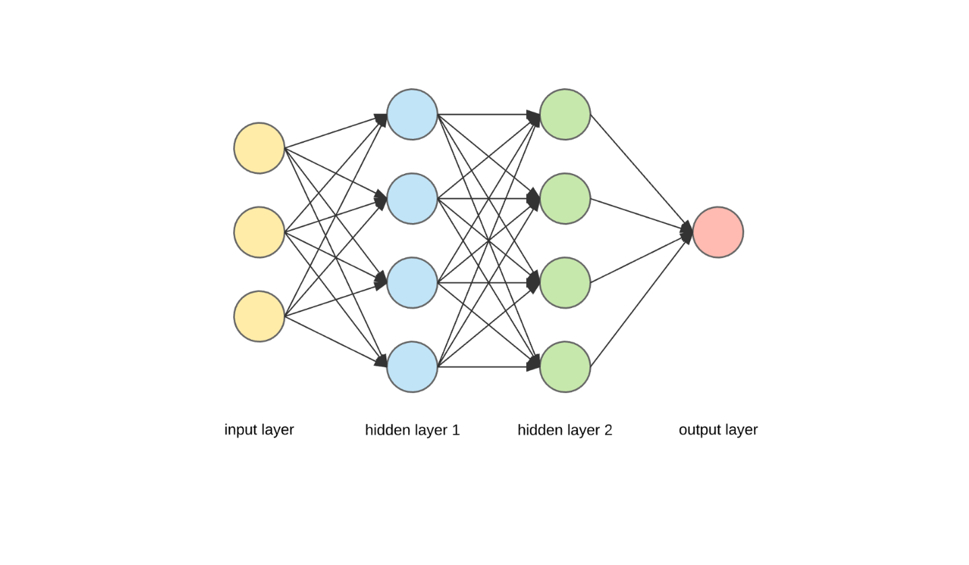
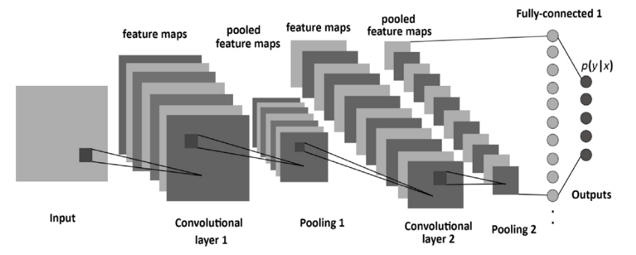
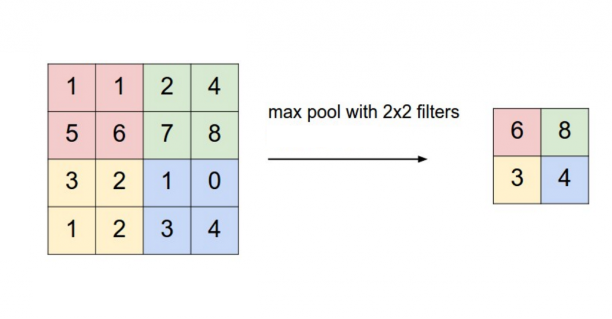
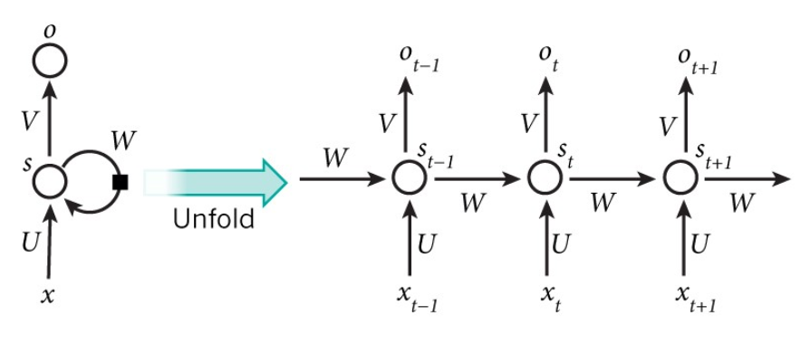

# IDS6145(SimTech 2019) - Research Plan
(remember all text between brackets to be removed in proposal and final, like template above)

> * Group Name: (be creative!) 123
> * Group participants names: Yifan Huang  and Tatiana Kashtanova
> * Project Title: (can be changed later)
(Abstract here - basically your pitch with some modification - but short overview)
(TEASER IMAGE HERE - should wow me to read your work)

(directions, - remove)
* (this Readme should "evolve" over time as you add and edit it)
* (once you are happy with it - copy it into the proposal directory, and remove the obvious sections that should be removed - Future work, etc)

## General Introduction

(States your motivation clearly: why is it important / interesting to solve this problem?)
(Add real-world examples, if any)
(Put the problem into a historical context, from what does it originate? Are there already some proposed solutions?)

(You should begin by introducing your topic. In this section, you should define the core terminology specific to the field, introduce the problem statement, and make clear the benefits (motivate!) of resolving that problem statement. The main difference between the ABSTRACT and Introduction sections is that the abstract summarizes the entire project, including results, whereas the introduc-tion only provides the motivation of the problem and an overview of the proposed solution.)

(I tell sutdents to answer the questions, one paragaph each to start if you are lost)

(Problem Statement. One paragraph to describe the prob-lem that you are tackling.)

(Motivation. Why is this problem interesting and relevant to the research community?)

(Proposed Solution. How do we propose to tackle this problem (that has been identified in the previous para-graphs, is interesting to the community, and has yet to be tackled by other researchers)?)

(Contributions. An enumeration of the contributions of the senior design project)

(This project makes the following contributions:)(you must have this!!)
•	(Contribution 1)
•	(Contribution 2)

***Artificial neural networks (ANN)***

An artificial neural network is a machine learning algorithm the idea of which takes its roots from the neural architecture of a human brain. The core components of a neural network are a neuron and a layer. A neuron is a node of a network that takes the weighted sum of its inputs (x1, x2, x3, … xn) and passes it through a mathematical function (the so-called activation function) to produce an output (y1). The output becomes the input of another neuron in the next layer. The most commonly used activation functions are step, sigmoid, tanh, and rectified linear unit [1]. The scheme of a node and its equation are presented on the figures below [2],  where n is the number of inputs for a node.

A layer is a group of neurons that process inputs through their activation functions and give outputs. An example of a neural network is presented on the figure below [2]. Every node of one layer is connected to all nodes of the next layer. The information flows from left to right.

The number of hidden layers is different in various neural networks. Hidden layers can have different activation functions depending on a research problem and the type of data being used [1].

***Convolutional neural network (CNN)***

A convolutional neural network is a variation of artificial neural networks the scheme of which is presented on the figure below [1].

A convolution layer takes an input signal and multiplies it with the kernel (a filter) to produce an output. There are usually hundreds or thousands of such convolutional layers that apply different filters and combine the results. 

Pooling layers are usually used after convolutional layers and subsample their input. Thus, for example, a max pooling function takes the maximum value of the input matrix or selected region while a min pooling function takes the minimum value of the input matrix or selected region (see an example on the figure below [3]). 

***Recurrent neural network (RNN)***

A recurrent neural network is another type of artificial neural networks. They are called “recurrent” as they process new signals using the information from previous steps [1]. 

On the figure above, x(t) is an input at time step t, s(t) is a hidden state at the same time step. s(t) is calculated based on the previous hidden state s(t-1) and the input at the current time step utilizing one of activation functions. o(t) is an output at step t. The same process is applied to all inputs at each time step.

References

[1. Nigam, V. (2018). Understanding neural networks. From neuron to RNN, CNN, and Deep Learning.]( https://towardsdatascience.com/understanding-neural-networks-from-neuron-to-rnn-cnn-and-deep-learning-cd88e90e0a90)

[2. Dertat, A. (2017). Applied Deep Learning – Part 1: artificial neural networks.] (https://towardsdatascience.com/applied-deep-learning-part-1-artificial-neural-networks-d7834f67a4f6)

[3. Britz, D. (2015). Understanding convolutional neural networks for NLP.]( http://www.wildml.com/2015/11/understanding-convolutional-neural-networks-for-nlp/)

## The Model

(Provide structural and behavior diagrams of the system you wish to study.) (Why is your model a good abtraction of the problem you want to study?) (Are you capturing all the relevant aspects of the problem?) (Use the model to tell us what is going on.)

(explicitly list your requirements of what the model will have and simulate for the proposal)

## Fundamental Questions
(At the end of the project you want to find the answer to these questions) (Formulate a few, clear questions. Articulate them in sub-questions, from the more general to the more specific. )

## Expected Results
(What are the answers to the above questions that you expect to find before starting your research?) (This changes from Expected (Proposal) to just Results (final report)) (you should verbally define them) (sketch a few graphs of what you are roughly going for - not the data but histogram of this, line graph of that, screenshot of an agent - use paper and pencil sketches)

## Research Methods
(Cellular Automata, Agent-Based Model, Discrete Event Continuous Modeling...)(Python or Anylogic) (If you are not sure here: 1. Consult your colleagues, 2. ask the teachers, 3. remember that you can change it afterwards) (Steps in the process)

## (Other)
(change the title and amount of headers as needed) (mention datasets you are going to use) (mention base code or examples you)

## Discussion
(final only - remove whole section for proposal Readme) (What would you have done differently) (What are the contributions summerize)(what is the big take away)(what did you learn)

## Future Work
(final only - remove whole section for proposal Readme) (if you had 6 more months what would be the next steps in this project.) (What are a few questions you have now)

## References
(Add the bibliographic references you intend to use)  (Code / Projects / blogs / websites / papers...)
