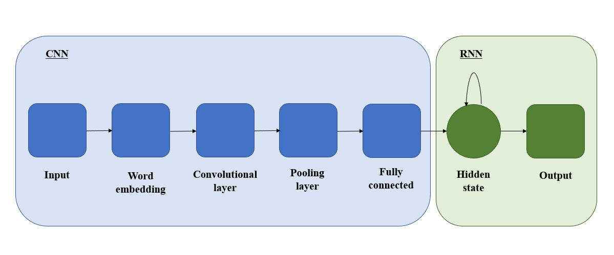

# IDS6145(SimTech 2019) - Research Plan

> * Group Name: 123
> * Group participants names: Yifan Huang and Tatiana Kashtanova
> * Project Title: Combination of CNN and RNN features for text classification

***Abstract***

The image was taken on the Developers website.

## General Introduction

Nowadays, a large amount of data in the form of text is available. Examples include social media chats, blogs, emails, customer reviews, articles, etc. Researches work on the development of automatic text data classification techniques that could perform sentiment analysis, topic labeling, structuring, intent detection, and other tasks in a fast and cost-effective way. Such procedures are of great interest to the government and private companies as they allow them to extract valuable insights from text data and help in decision making *(MonkeyLearn, n.d.)*.

Among the most widely used machine learning techniques for text classification are deep learning algorithms, particularly convolutional and recurrent neural networks (CNN and RNN). They have found their application in automatic text summarization *(Yousefi-Azar, & Hamey, 2017)*, sentence classification *(Kim, 2014)*, single-relation question answering *(Yih, He, & Meek, 2014)*, translation *(Auli, Galley, Quirk, & Zweig, 2013)*, and other tasks. The current work is focused on enhancing the accuracy of deep learning architectures on diverse datasets. Some of the approaches include joining CNN and RNN variants. Thus, for example, *Alayba, Palade, England, and Iqbal (2018)* designed a model consisted of the following parts: input data (word embeddings and character / character N-gram/ word-level representation), convolutional layer with feature maps, max pooling layer, Long Short-Term Memory (LSTM) layer, fully connected layer, and output. The design allowed the researchers to achieve higher accuracy (2.4% and 0.7%) of Arabic sentiment analysis on two datasets they tested.

*Wang, Jiang and Luo (2016)* studied the combination of CNN and a gated recurrent unit (GRU) and the combination of CNN and LSTM for short text sentiment analysis. Their model included the following parts: word embeddings and sentence-level representation, convolutional and max-pooling layers, concatenation layer, RNN layer, and fully connected layer with softmax output. The researches explored different model variations using pre-trained vectors from word2vec, randomly initialized vectors, max pooling layers and average pooling layers. Models with pre-trained vectors from word2vec and max pooling performed best among all the models and allowed to increase the classification accuracy by 0.7% (using GRU) and 0.1% (using LSTM) on some datasets.

*Giannakopoulos, Coriou, Hossmann, Baeriswyl, and Musat (2019)* created a model that combined Ensembles, CNN, GRU, and Attention. The final prediction was obtained by averaging the predictions from all the learners. The researches tested the architecture on argumentation mining, topic classification, and textual churn. The model led to a performance increase on all the text classification tasks. 

In order to contribute to the current research on designing more efficient and accurate deep learning architectures for text classification, we propose our joined CNN and RNN model that is different from existing models in the following ways:

## The Model

(Provide structural and behavior diagrams of the system you wish to study.) (Why is your model a good abtraction of the problem you want to study?) (Are you capturing all the relevant aspects of the problem?) (Use the model to tell us what is going on.)

(explicitly list your requirements of what the model will have and simulate for the proposal)

## Fundamental Questions
(At the end of the project you want to find the answer to these questions) (Formulate a few, clear questions. Articulate them in sub-questions, from the more general to the more specific. )

## Expected Results
(What are the answers to the above questions that you expect to find before starting your research?) (This changes from Expected (Proposal) to just Results (final report)) (you should verbally define them) (sketch a few graphs of what you are roughly going for - not the data but histogram of this, line graph of that, screenshot of an agent - use paper and pencil sketches)

## Research Methods
(Cellular Automata, Agent-Based Model, Discrete Event Continuous Modeling...)(Python or Anylogic) (If you are not sure here: 1. Consult your colleagues, 2. ask the teachers, 3. remember that you can change it afterwards) (Steps in the process)

## Dataset

The dataset comes from the work “Seeing stars: Exploiting class relationships for sentiment categorization with respect to rating scales” by Bo Pang and Lillian Lee (2005). 

Data Format Summary:

  * rt-polarity.pos contains 5331 positive snippets
  * rt-polarity.neg contains 5331 negative snippets

Each line in these two files corresponds to a single snippet; all snippets are down-cased. The snippets were labeled in such a way that snippets (from Rotten Tomatoes webpages) for reviews marked with "fresh" were considered to be positive, and those for reviews marked with “rotten” were considered to be negative.

## Code

## Discussion
(final only - remove whole section for proposal Readme) (What would you have done differently) (What are the contributions summerize)(what is the big take away)(what did you learn)

## Future Work
(final only - remove whole section for proposal Readme) (if you had 6 more months what would be the next steps in this project.) (What are a few questions you have now)

## References

[Developers. (n.d.) Build a Text Classification Program: An NLP Tutorial.](https://www.toptal.com/machine-learning/nlp-tutorial-text-classification)

[MonkeyLearn. (n.d.). Text classification. A comprehensive guide to classifying text with Machine Learning.](https://monkeylearn.com/text-classification/)

[Alayba, A. M., Palade, V., England, M., & Iqbal, R. (2018). A Combined CNN and LSTM Model for Arabic Sentiment Analysis. *Proc. International Cross-Domain Conference for Machine Learning and Knowledge Extraction. CD-MAKE 2018, Lecture Notes in Computer Science,11015*, 179-191.](https://arxiv.org/abs/1807.02911)

[Wang, X., Jiang, W., & Luo, Z. (2016). Combination of Convolutional and Recurrent Neural Network for Sentiment Analysis of Short Texts. *Proceedings of COLING 2016: The 26th International Conference on Computational Linguistics: Technical Papers*. Osaka, Japan, 2428–2437.](https://www.aclweb.org/anthology/C16-1229) 

[Yousefi-Azar, M., & Hamey, L. (2017). Text summarization using unsupervised deep learning. *Expert Systems With Applications, 68*, 93–105.](https://www.sciencedirect.com/science/article/pii/S0957417416305486)

[Yih, S.W., He, X., & Meek, C. (2014). Semantic parsing for single-relation question answering. *Proceedings of the 52nd Annual Meeting of the Association for Computational Linguistics: Short Papers, 2*. ACL, Baltimore, 643–648.](http://acl2014.org/acl2014/P14-2/pdf/P14-2105.pdf)

[Kim, Y. (2014). Convolutional neural networks for sentence classification. *Proceedings of the 2014 Conference on Empirical Methods in Natural Language Processing (EMNLP)*. ACL, Doha, 1746–1751.](https://www.aclweb.org/anthology/D14-1181)

[Auli, M.W., Galley, M., Quirk, C., & Zweig, G. (2013). Joint language and translation modeling with recurrent neural networks. *Proceedings of the 2013 Conference on Empirical Methods in Natural Language Processing*. ACL, Seattle, 044–1054.](https://www.aclweb.org/anthology/D13-1106) 

[Giannakopoulos, A., Coriou, M., Hossmann, A., Baeriswyl, M., & Musat, C. (2019). Resilient Combination of Complementary CNN and RNN Features for Text Classification through Attention and Ensembling.](https://arxiv.org/pdf/1903.12157.pdf)

[Pang, B., & Lee, L. (2005). Seeing stars: Exploiting class relationships for sentiment categorization with respect to rating scales, Proceedings of the ACL, 115-124.](http://www.cs.cornell.edu/people/pabo/movie-review-data/)
